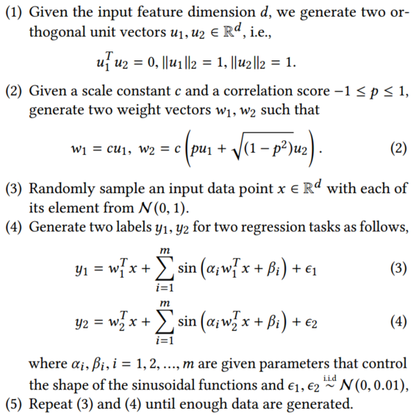

# Explaination of normalization and orthogonal unit vector generation in Paper ["Modeling Task Relationships in Multi-task Learning with Multi-gate Mixture-of-Experts"](https://dl.acm.org/doi/abs/10.1145/3219819.3220007)

## 1. Normalization
### 1.1 L2 Norm
$$
\mu = \frac{\nu}{\|\nu\|_2}
$$

### 1.2 z-score normalization
$$
\begin{equation}
    \mu = \frac{\nu-mean(\nu)}{std(\nu)}
\end{equation}
$$
$$
\begin{equation}
    \mu = \frac{\mu}{sqrt(n)}, n=len(\mu)
\end{equation}
$$
The step 1 completes z-score normalization, and step 2 finishes the unit process.
_**Prove**_
> $$\begin{equation} std(\nu)=\sqrt{\frac{1}{n}\times\sum_{i}\left(\nu_{i}-mean(\nu)\right)^{2}} 
\end{equation}$$ replace std with eq.3 in eq.1，and get $$ \begin{equation} \mu = \sqrt{n}\times\frac{\nu-mean(\nu)}{\sqrt{\sum_{i}\left(\nu_{i}-mean(\nu)\right)^{2}}} \end{equation} $$ the right part $\frac{\nu-mean(\nu)}{\sqrt{\sum_{i}\left(\nu_{i}-mean(\nu)\right)^{2}}}$ is one normalized vector with L2 norm. Above process is z-score normalization. Obviously, $\mu$ in eq.1 is a normalization vector with coefficient. Therefore, the final $\mu$ in eq.2 is obtained by deviding $\sqrt{n}$

## **Orthogonal vector generation**
m1 is a random vector, m2 is a unit vector. How to transform m1 into a vector orthogonal to m2?
_**process**_
> $$ m1 = m1 - dot(m1, m2) * m2 $$

_**prove**_

> $ dot(m1, m2) $ means the projection length of m1 in the m2 direction. Because m2 is a unit vector, we can know that dot(m1, m2) * m2 is one projection vector in m2 direction easily. Lastly, $ m1 = m1 - dot(m1, m2) * m2 $ is a vector orthogonal to m2.

